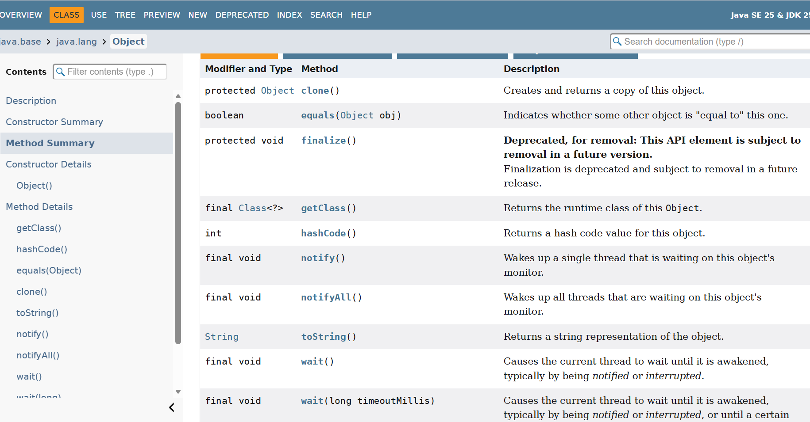

# AI Use Statement

Replace this with your AI Use Statement, which is required **WHETHER OR NOT** you used AI.
Failure to include this statement will result in a reduced grade of up to 100%. 

- I actually had a lot of help from people that are familiar with java than me. I also worked with my tutor to complete the lab.
- I also did some research on google to figure out methods and meanings/use. I did use a little of ai in the begining to help me structure the lab in a way that i can understand  